# Experiment Analysis — Pooled (both datasets as one corpus, N=58)

*All 58 contracts (25 DeFiHackLabs + 33 SmartBugs) treated as one corpus, run by all 6 methods. The 3
LLM-driven methods (MADFuzz / LLMFuzz / SSCFuzz) are additionally swept over 1.5B / 3B / 7B backends across Part B's method-comparison views (B1–B8 — each backend size shown as its own bar / line / box / column / table row); the SSCFuzz-internal sections (B9, B10) and Parts C–E stay on the 1.5B backend.
Figures: `research/figures/experiment_combined/`.*

> **Reading guide.** This file is **results only** — every section is a table or a figure with a short
> *how-to-read* caption (axes + what "good" looks like). No interpretation/claims here; those live in
> `research/research.md` and the paper. The two corpora sit at opposite ends of the size/coverage axis, so
> pooled numbers blend two regimes — use [combined](experiment_analysis_combined.md) for the stratified view.
> Single-dataset detail: [defihacklabs](experiment_analysis_defihacklabs.md) ·
> [smartbugs](experiment_analysis_smartbugs.md).

<!-- TOC -->
## Contents

- [Setup](#setup)
- [Part A · Dataset EDA](#part-a--dataset-eda)
  - [A1. Vulnerability-class distribution](#a1-vulnerability-class-distribution)
  - [A2. Static feature profile — median (mean) per corpus](#a2-static-feature-profile--median-mean-per-corpus)
  - [A3. Feature collinearity](#a3-feature-collinearity)
  - [A4. Sample difficulty distribution](#a4-sample-difficulty-distribution)
- [Part B · Method results](#part-b--method-results)
  - [B1. Detection & coverage](#b1-detection--coverage)
  - [B2. Coverage growth](#b2-coverage-growth)
  - [B3. Coverage distribution](#b3-coverage-distribution)
  - [B4. Time-to-first-bug](#b4-time-to-first-bug)
  - [B5. SSCFuzz vs each baseline (paired, N=58)](#b5-sscfuzz-vs-each-baseline-paired-n58)
  - [B6. Complementarity & head-to-head](#b6-complementarity--head-to-head)
  - [B7. Cost efficiency](#b7-cost-efficiency)
  - [B8. Detection by vulnerability class](#b8-detection-by-vulnerability-class)
  - [B9. Action selection](#b9-action-selection)
  - [B10. Sequence depth × width](#b10-sequence-depth--width)
- [Part C · Feature ↔ outcome](#part-c--feature--outcome)
  - [C1. Feature ↔ coverage](#c1-feature--coverage)
  - [C2. Feature ↔ solvability](#c2-feature--solvability)
  - [C3. Breadth × depth](#c3-breadth--depth)
  - [C4. Generation difficulty (PoC-derived) ↔ solvability](#c4-generation-difficulty-poc-derived--solvability)
- [Part D · SSCFuzz internals](#part-d--sscfuzz-internals)
  - [D1. Per-strategy search yield](#d1-per-strategy-search-yield)
  - [D2. Strategy × vulnerability class (genuine)](#d2-strategy--vulnerability-class-genuine)
  - [D3. Mutation: genuine vs inherited](#d3-mutation-genuine-vs-inherited)
  - [D4. Selection vs yield](#d4-selection-vs-yield)
  - [D5. RL-greedy vs ε-random](#d5-rl-greedy-vs-ε-random)
  - [D6. Strategy selection over iterations](#d6-strategy-selection-over-iterations)
- [Part E · Oracle precision](#part-e--oracle-precision)
  - [E1. FinanceFuzz — detected property vs planted class](#e1-financefuzz--detected-property-vs-planted-class)
  - [E2. Detection & union under strict scoring](#e2-detection--union-under-strict-scoring)
  - [E3. In-house signal caveat — PLN](#e3-in-house-signal-caveat--pln)

<!-- /TOC -->

## Setup

| | |
|---|---|
| Corpus | 58 contracts = 25 DeFiHackLabs + 33 SmartBugs, each run by all 6 methods |
| Budget | 100 iterations / contract / method |
| Methods | `randomfuzz` · `financefuzz` · `rlfuzz` · `madfuzz` · `llmfuzz` · `sscfuzz` (ours) |
| LLM backends (B1–B8) | 1.5B (base) · 3B · 7B — swept for `madfuzz`/`llmfuzz`/`sscfuzz` only |

# Part A · Dataset EDA

*Static contract structure — no fuzzing results, so identical across LLM backend sizes; the backend comparison lives in Part B's method-comparison figures + the B1 / B5 tables.*

## A1. Vulnerability-class distribution

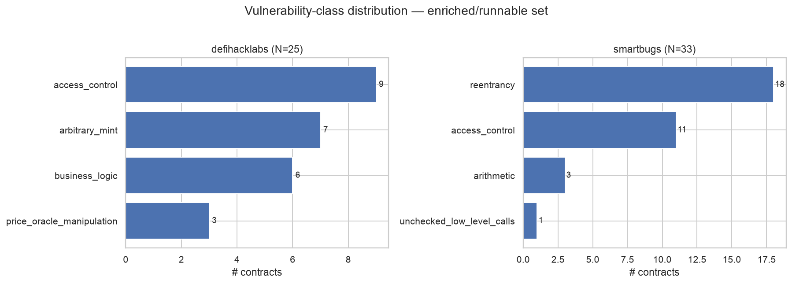

| class | n | | class | n |
|---|---|---|---|---|
| access_control | 20 | | business_logic | 6 |
| reentrancy | 18 | | arithmetic | 3 |
| arbitrary_mint | 7 | | price_oracle_manipulation | 3 |
| | | | unchecked_low_level_calls | 1 |

*How to read:* labelled vuln class pooled over the 58 contracts (per-class denominator for B8).

## A2. Static feature profile — median (mean) per corpus

| feature | DeFiHackLabs | SmartBugs |
|---|---|---|
| `loc` | 477 (554) | 26 (48) |
| `cyclomatic_complexity` | 47 (52) | 4 (5.9) |
| `total_fn_count` | 57 (61) | 4 (4.9) |
| `external_fn_count` | 14 (16) | 4 (4.2) |
| `max_branches_per_fn` | 11 (16) | 2 (3.2) |
| `constraint_density` | 0.05 (0.05) | 0.02 (0.04) |

*How to read:* the pooled corpus is composed of these two regimes (shown separately because a single pooled
median would conflate them).

## A3. Feature collinearity

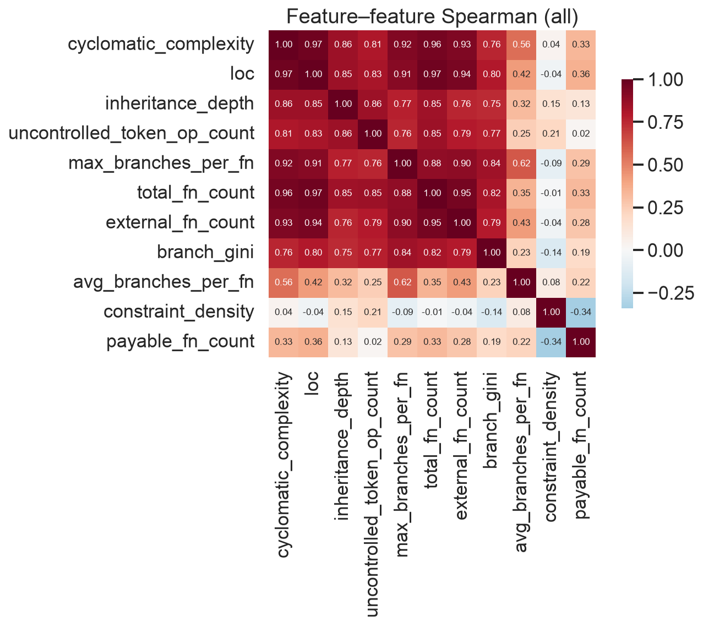

*How to read:* Spearman ρ between every pair of static features over the pooled 58; darker = more correlated.

## A4. Sample difficulty distribution

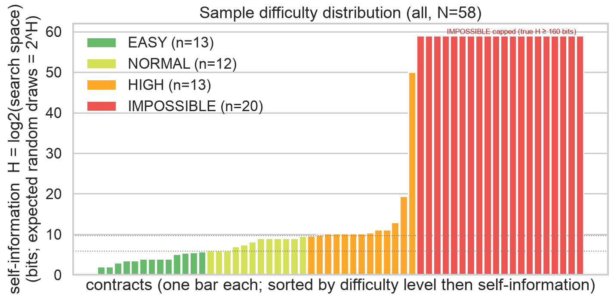

*How to read:* one bar per contract; **bar height = self-information `H = log₂(RandomFuzz search-space size) = −log₂ P`**,
the probability the blind RandomFuzz baseline draws a satisfying input in one try (so expected random draws
≈ 2^H) — computed from the ground-truth PoC, no fuzzer run. Each call adds `log₂(F)` (F = callable functions
= `external_fn_count`); each constrained argument adds `log₂(pool)` where the pool is RandomFuzz's draw set
(address corpus = declared externals + `hardcoded_address_count`; small-value/constant pool = `magic_number_count`); a coordinate RandomFuzz CANNOT draw takes the full type domain (2²⁵⁶ / 2¹⁶⁰): a runtime-derived `$ret` value, a specific on-chain address not in the seeded corpus, or a numeric literal outside RandomFuzz's boundary/scale pool (a keccak storage slot or an arbitrary large amount); a burn/zero address (`0x…dEaD` / `0x0`) is an arbitrary recipient → free. **Color = difficulty level:** EASY · NORMAL · HIGH are data-driven tertiles of H over the RandomFuzz-reachable contracts
(dotted lines = tertile edges); IMPOSSIBLE = needs a RandomFuzz-unreachable coordinate, bars capped
for display. Per-level counts: EASY 13 · NORMAL 12 · HIGH 13 · IMPOSSIBLE 20.

# Part B · Method results

## B1. Detection & coverage

| method | det 1.5B | det 3B | det 7B | cov 1.5B | cov 3B | cov 7B |
|---|---|---|---|---|---|---|
| RandomFuzz | 22.4 % (13/58) | 22.4 % (13/58) | 22.4 % (13/58) | 0.576 | 0.576 | 0.576 |
| FinanceFuzz | 12.1 % (7/58) | 12.1 % (7/58) | 12.1 % (7/58) | 0.400 | 0.400 | 0.400 |
| RLFuzz | 39.7 % (23/58) | 39.7 % (23/58) | 39.7 % (23/58) | 0.650 | 0.650 | 0.650 |
| MADFuzz | 36.2 % (21/58) | 34.5 % (20/58) | — | 0.619 | 0.613 | — |
| LLMFuzz | 31.0 % (18/58) | 39.7 % (23/58) | 43.1 % (25/58) | 0.514 | 0.554 | 0.543 |
| SSCFuzz (ours) | 39.7 % (23/58) | 48.3 % (28/58) | 46.6 % (27/58) | 0.617 | 0.623 | 0.623 |

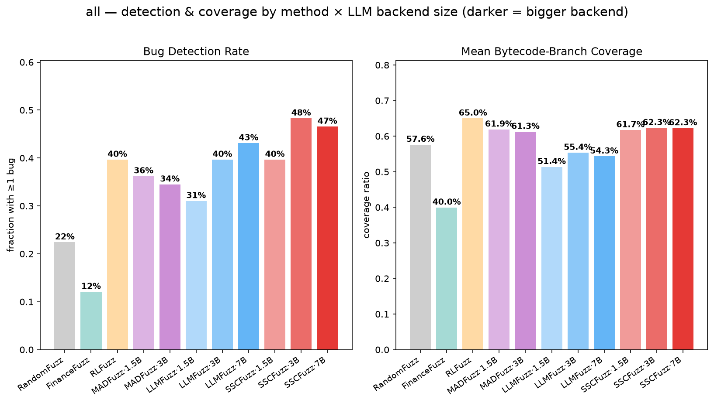

*How to read:* det = fraction of the paired contracts with ≥1 bug (k/n in parens); cov = mean bytecode-branch
coverage ratio. The three sub-columns per metric are the LLM backend size — 1.5B / 3B / 7B of one model family.
RandomFuzz / FinanceFuzz / RLFuzz do not call the LLM, so their size columns repeat one run. `—` = that size's
run is not available for this set (absent, partial, or unfinished); the pooled corpus needs both datasets, so a
7B cell is `—` whenever either dataset's 7B run is missing. **Figure:** one bar per method × backend size —
coloured by method, darker = bigger backend; LLM-free methods appear once, and a size with no complete run
(pooled) has no bar. (FinanceFuzz detection validity → Part E.)

## B2. Coverage growth

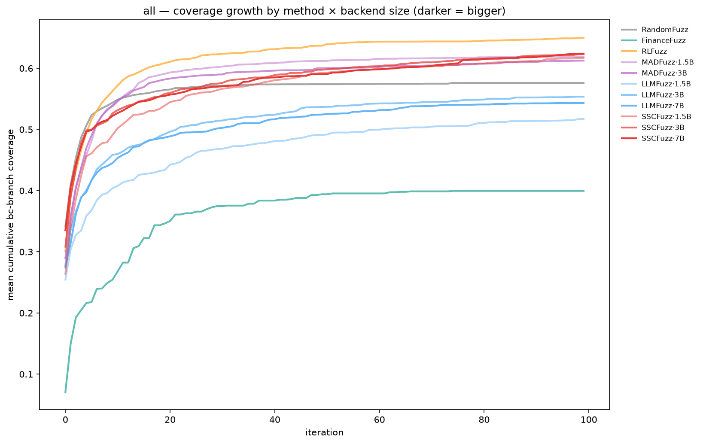

*How to read:* x = iteration, y = cumulative mean coverage; higher and still-rising = better. Each LLM-driven method is one line per backend size (1.5B / 3B / 7B; darker = bigger); RandomFuzz / FinanceFuzz / RLFuzz appear once.

## B3. Coverage distribution

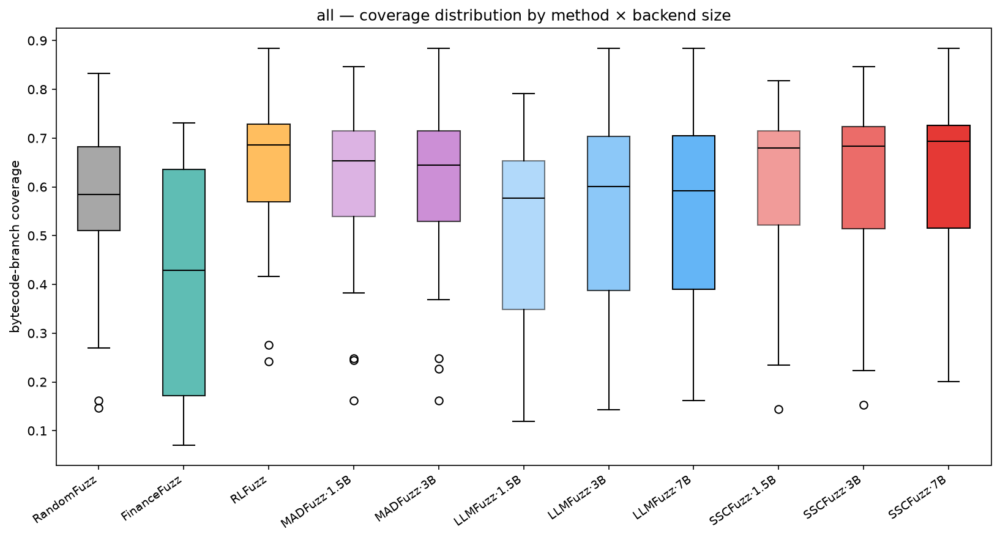

*How to read:* over all 58 (bimodal — the two corpora), higher median + tighter = better. One box per (method × backend size) — LLM-driven methods get a box per size (1.5B / 3B / 7B, darker = bigger), LLM-free once.

## B4. Time-to-first-bug

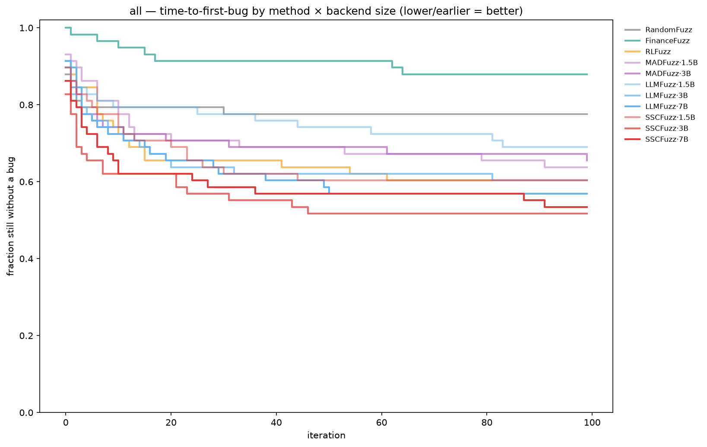

*How to read:* Kaplan–Meier — y = fraction still without a bug at iteration x; dropping early and low = better. One line per (method × backend size), darker = bigger backend; LLM-free methods appear once.

## B5. SSCFuzz vs each baseline (paired, N=58)

| baseline (method × backend size) | Δ mean cov | Cliff's δ | Wilcoxon p | McNemar p (detection) |
|---|---|---|---|---|
| RandomFuzz | +0.041 | +0.24 | 0.0003 | 0.013 |
| FinanceFuzz | +0.218 | +0.57 | <0.001 | 0.002 |
| RLFuzz | −0.033 | −0.10 | <0.001 | 1.000 |
| MADFuzz·1.5B | −0.002 | +0.01 | 0.660 | 0.688 |
| MADFuzz·3B | +0.005 | +0.05 | 0.648 | 0.508 |
| LLMFuzz·1.5B | +0.103 | +0.34 | <0.001 | 0.227 |
| LLMFuzz·3B | +0.064 | +0.20 | <0.001 | 1.000 |
| LLMFuzz·7B | +0.074 | +0.23 | <0.001 | 0.754 |
| SSCFuzz·3B | −0.006 | −0.03 | 0.481 | 0.180 |
| SSCFuzz·7B | −0.006 | −0.04 | 0.876 | 0.344 |

*How to read:* reference = **SSCFuzz·1.5B (ours)**; Δcov = ours − the row's (method × backend size), positive =
ours covers more; the SSCFuzz·3B/·7B rows compare bigger backends of our own method against 1.5B.
|Cliff's δ|>0.47 = large; p<0.05 = significant. Pooled paired set (N=58).

## B6. Complementarity & head-to-head

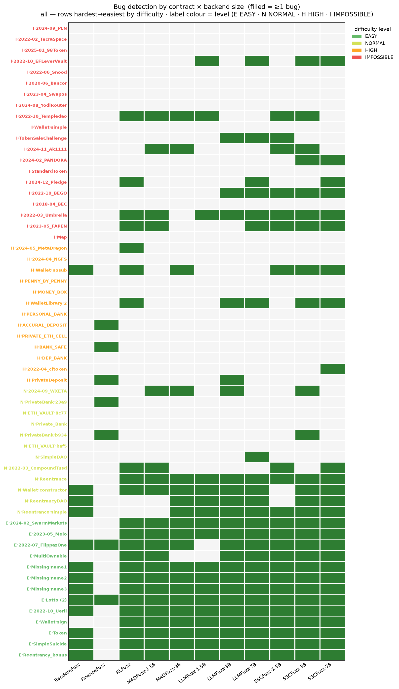

| method × backend size | unique solves | total solves |
|---|---|---|
| RandomFuzz | 0 | 13 |
| FinanceFuzz | 3 | 7 |
| RLFuzz | 1 | 23 |
| MADFuzz·1.5B | 0 | 21 |
| MADFuzz·3B | 0 | 20 |
| LLMFuzz·1.5B | 0 | 18 |
| LLMFuzz·3B | 0 | 23 |
| LLMFuzz·7B | 1 | 25 |
| SSCFuzz·1.5B | 0 | 23 |
| SSCFuzz·3B | 0 | 28 |
| SSCFuzz·7B | 1 | 27 |

*How to read:* heatmap = which (method × backend size) (column) solves which contract (row); green = ≥1 bug.
Rows are sorted hardest→easiest by PoC difficulty (A4), and each contract is prefixed with its level initial
(`E`=EASY / `N`=NORMAL / `H`=HIGH / `I`=IMPOSSIBLE). unique solves = contracts no other (method × size) finds.
Union over all method × backend size = 38/58 (any-signal; strict scoring → E2).

## B7. Cost efficiency

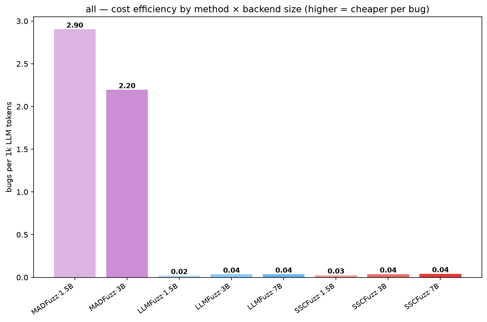

*How to read:* bugs per 1k LLM tokens (Random/RL token-free); higher = cheaper per bug. One bar per (method × backend size), darker = bigger; token-free methods (Random/RL) are omitted.

## B8. Detection by vulnerability class

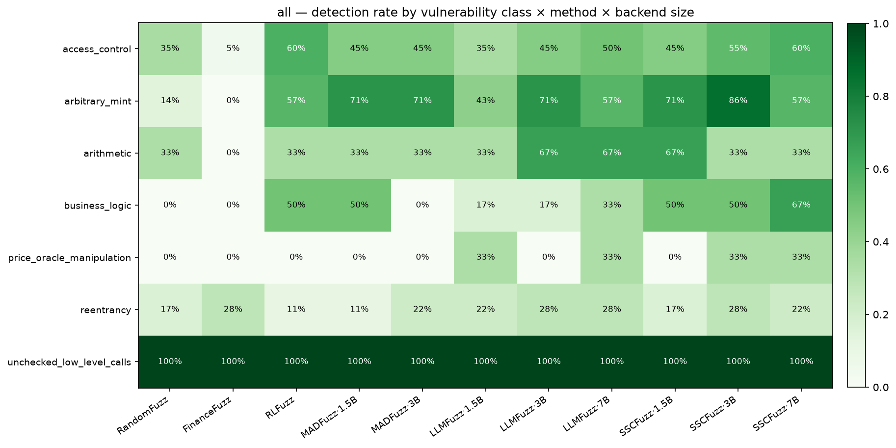

*How to read:* rows = vulnerability class, columns = each (method × backend size); cell = detection rate on that class (k-with-bug / class n), greener = higher. LLM-driven methods span 1.5B / 3B / 7B (left→right), LLM-free (Random/Finance/RL) appear once; a size with no complete run is omitted. (Classes differ by corpus; FinanceFuzz credit is by reported signal → Part E.)

## B9. Action selection

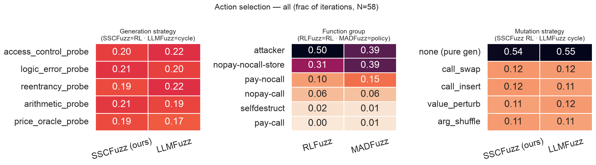

*How to read:* fraction of a method's iterations spent on each strategy / group / mutation (RandomFuzz
excluded). Flat = broad exploration; concentrated = narrow policy.

## B10. Sequence depth × width

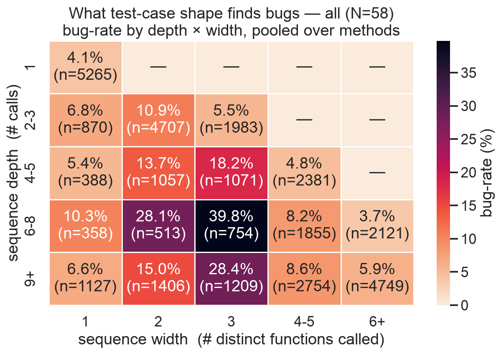

*How to read:* depth = #calls, width = #distinct functions; cell = bug-rate of that shape. Hotter = more
likely to trigger a bug.

# Part C · Feature ↔ outcome

*Pooled feature↔outcome — magnitudes conflate within- and between-corpus effects; use the per-dataset
reports for within-corpus numbers.*

## C1. Feature ↔ coverage

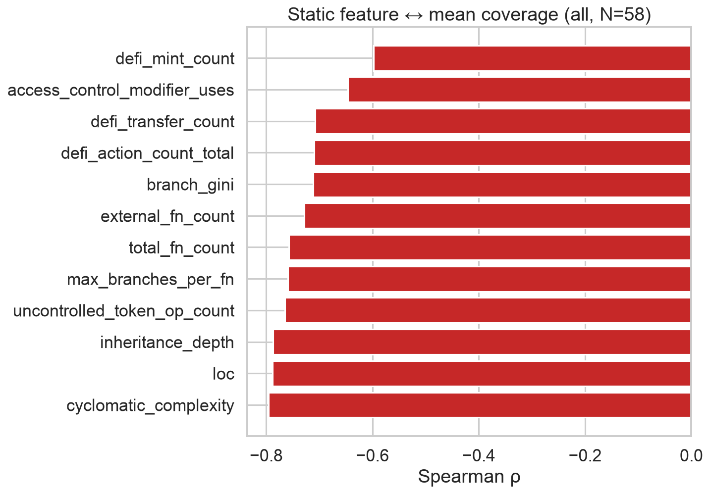

*How to read:* ρ between each feature and mean coverage; negative = harder to cover.

## C2. Feature ↔ solvability

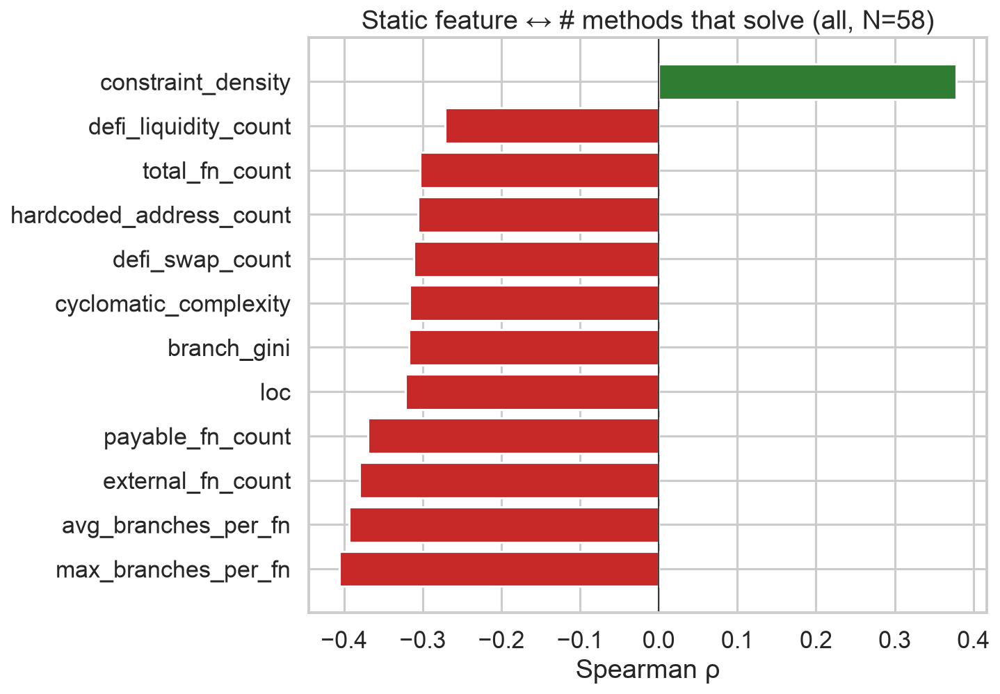

*How to read:* solvability = how many of the 6 methods find a bug; ρ vs each feature (negative = harder).

## C3. Breadth × depth

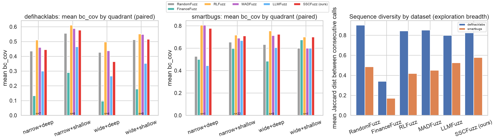

*How to read:* contracts split at each dataset's own median breadth × depth → 4 quadrants; cell = the
coverage-winning method per quadrant.

## C4. Generation difficulty (PoC-derived) ↔ solvability

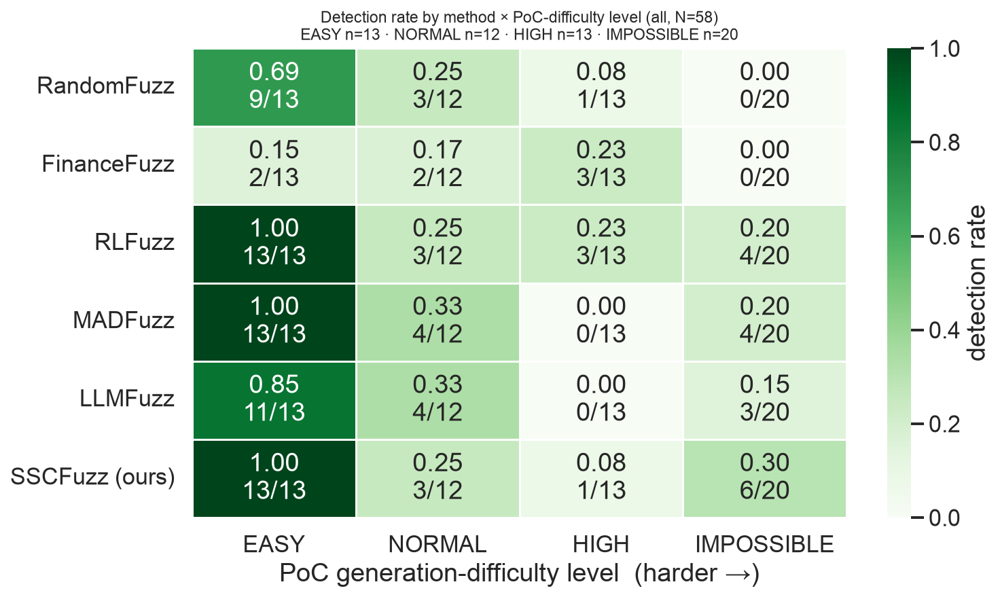

| method | EASY (13) | NORMAL (12) | HIGH (13) | IMPOSSIBLE (20) |
|---|---|---|---|---|
| RandomFuzz | 0.69 (9/13) | 0.25 (3/12) | 0.08 (1/13) | 0.00 (0/20) |
| FinanceFuzz | 0.15 (2/13) | 0.17 (2/12) | 0.23 (3/13) | 0.00 (0/20) |
| RLFuzz | 1.00 (13/13) | 0.25 (3/12) | 0.23 (3/13) | 0.20 (4/20) |
| MADFuzz | 1.00 (13/13) | 0.33 (4/12) | 0.00 (0/13) | 0.20 (4/20) |
| LLMFuzz | 0.85 (11/13) | 0.33 (4/12) | 0.00 (0/13) | 0.15 (3/20) |
| SSCFuzz (ours) | 1.00 (13/13) | 0.25 (3/12) | 0.08 (1/13) | 0.30 (6/20) |

*How to read:* rows = methods; columns = PoC-difficulty level, left→right **EASY** (n=13) · **NORMAL**
(n=12) · **HIGH** (n=13) · **IMPOSSIBLE** (n=20), each with its contract count in the header. Each cell =
that method's detection rate on that level (rate over k/n); greener = higher rate. Level = RandomFuzz
reachability (defined in [A4](#a4-sample-difficulty-distribution)): an IMPOSSIBLE contract needs a value
RandomFuzz cannot draw, so a nonzero IMPOSSIBLE cell is a guided method that detected it anyway.

# Part D · SSCFuzz internals

*SSCFuzz per-iteration logs only, pooled; RL-greedy vs ε-random picks (ε = ~uniform strategy sample). 9
strategies = 5 generation + 4 mutation.*

## D1. Per-strategy search yield

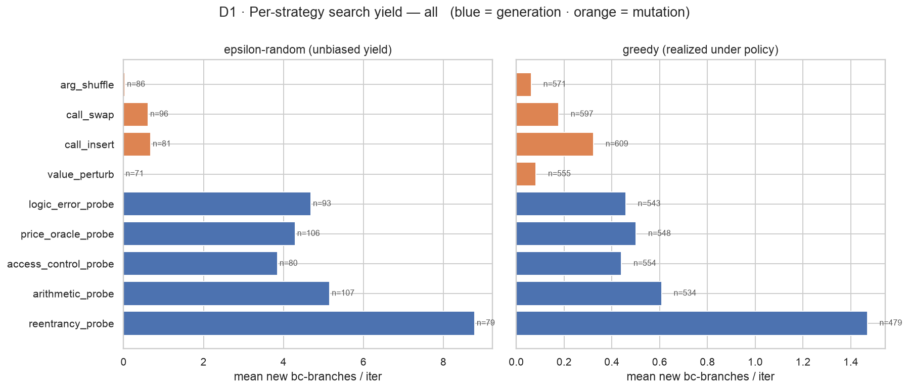

*How to read:* mean new bytecode-branches/iter per strategy (ε-unbiased vs greedy-realized); blue = generation,
orange = mutation. Taller = more new coverage per call.

## D2. Strategy × vulnerability class (genuine)

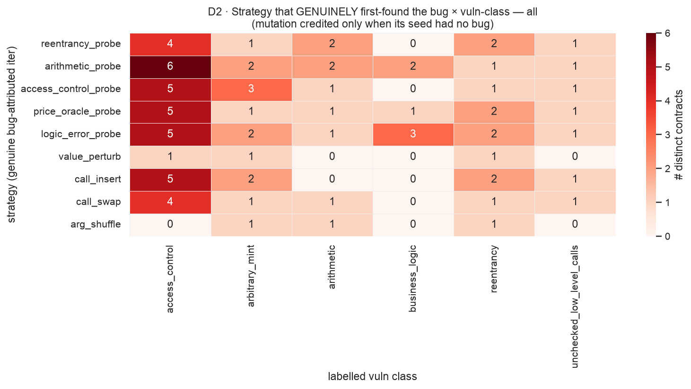

*How to read:* distinct contracts each strategy genuinely first-solved per class (genuine = the iteration's
own call created a bug its seed did not have). A diagonal = specialists.

## D3. Mutation: genuine vs inherited

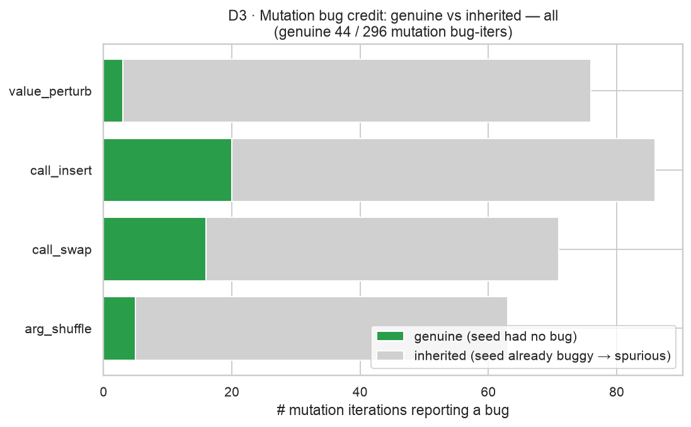

*How to read:* of mutation bug-iterations, green = genuine (seed had no bug), grey = inherited (spurious).
More green = more real mutation contribution.

## D4. Selection vs yield

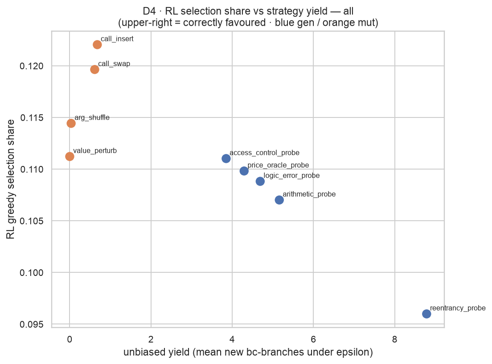

*How to read:* x = unbiased yield (D1), y = RL greedy selection share; upper-right = budget on high-yield
strategies.

## D5. RL-greedy vs ε-random

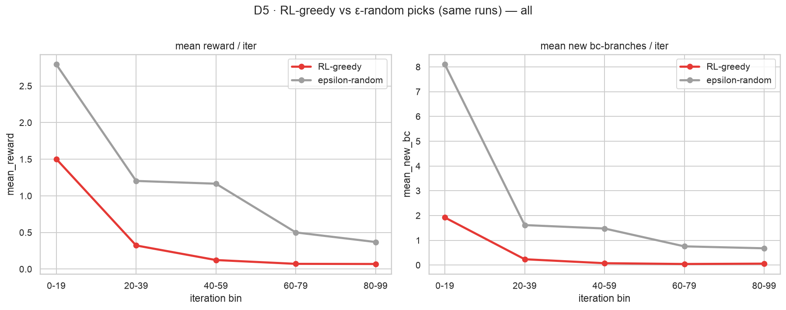

*How to read:* mean reward / new-branches of greedy vs ε-random picks within the same runs, per iteration bin.
Compare the two lines per panel.

## D6. Strategy selection over iterations

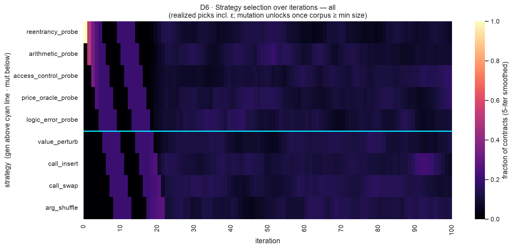

*How to read:* fraction of contracts choosing each strategy at each iteration (5-iter smoothed); generation
above the cyan line, mutation below. Bright band = a strategy the policy concentrates on.

# Part E · Oracle precision

## E1. FinanceFuzz — detected property vs planted class

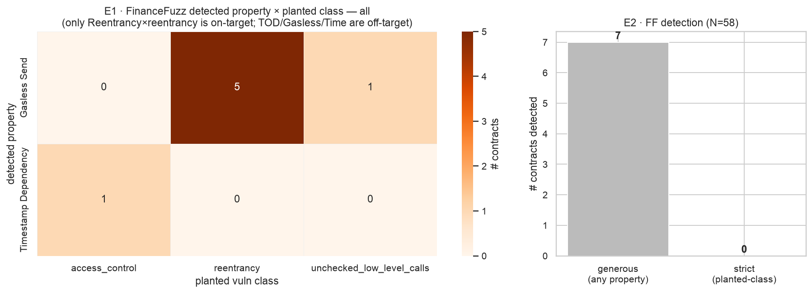

*How to read:* each FinanceFuzz detection by detected property (TOD / Gasless / Timestamp / Reentrancy) ×
planted class; only `Reentrancy × reentrancy` is on-target. Bar = detection count under generous (any
property) vs strict (property matches planted class).

## E2. Detection & union under strict scoring

| quantity | n / 58 |
|---|---|
| FF detection — generous | 7 |
| FF detection — strict | 0 |
| 5 in-house union | 30 |
| union + FF (generous) | 35 |
| union + FF (strict) | 30 |
| FF unique solves (generous / strict) | 5 / 0 |

*How to read:* generous counts any property; strict counts only detections whose property matches the planted
class. "union + FF" shows FF's marginal contribution over the 5 in-house methods.

## E3. In-house signal caveat — PLN

PLN (`2024-09_PLN`, DeFiHackLabs) is the documented false-positive trap for the financial-loss oracle: a
naive "gained PLN tokens" check (`attacker_gained` heuristic) fires with no *net* profit (the attacker also
paid WETH). The net-profit oracle (`attacker_profit`) suppresses it — in these runs no method flags PLN. The
in-house signal is an *outcome* (real value extraction), precise about loss but not mechanism (see
`research/related_work/oracle_financial_loss_research.md`).
